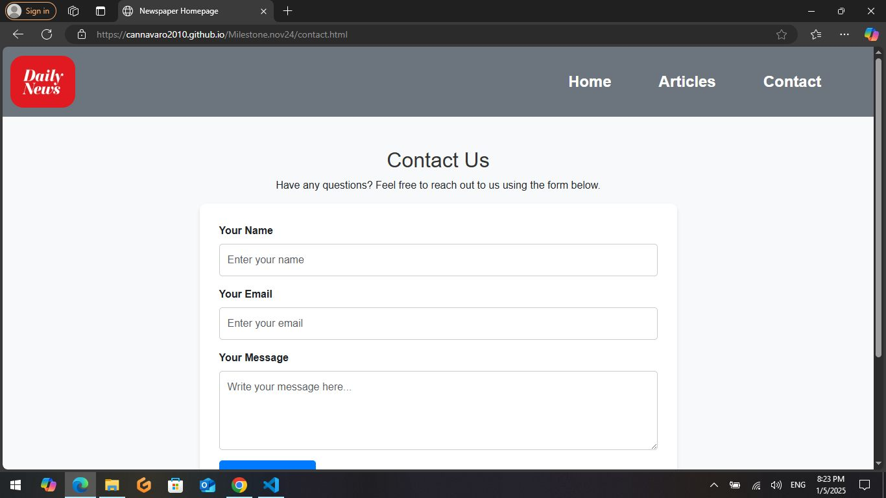
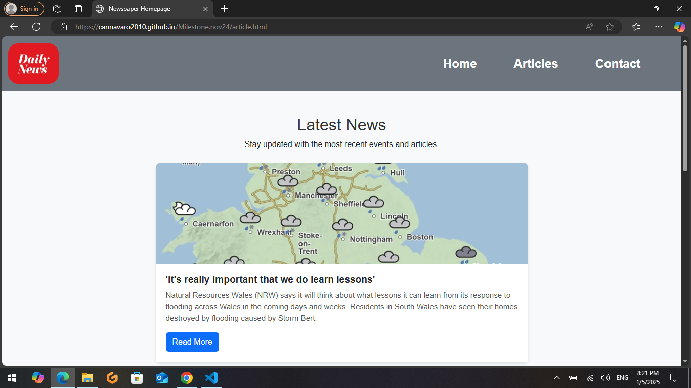
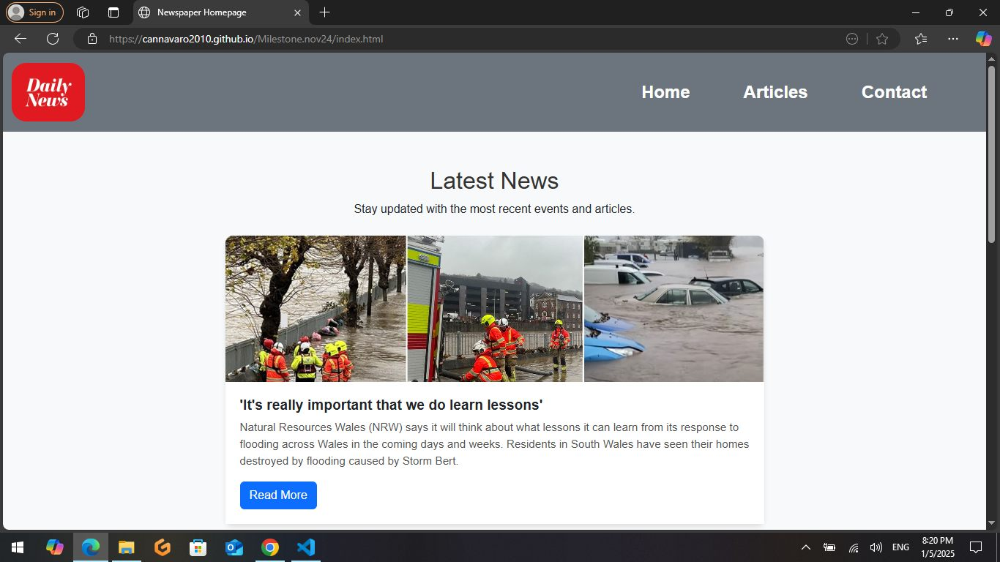

# News Daily Website

This project is a simple **newspaper website** built using **HTML**, **CSS**, and **Bootstrap**, featuring a responsive layout with news articles, 
weather information, and social media icons. The website uses real-time information from **Google Images**, **Sky News**, and **UK Weather API** to display news and weather data.
Additionally, it integrates **Font Awesome** for social media icons in the footer.

### Created By:
**Youssef Abassir**
Details of Value
Our website offers a unique and engaging platform for users to stay informed and connected with the latest news. By visiting our site, web users can expect to gain a range of valuable benefits that cater to diverse interests and needs.

What Users Gain from Our Website:
Up-to-Date Information: Our website provides real-time news updates, ensuring that users are always informed of the latest events from around the world. Whether it's breaking news or in-depth analysis, we have it covered.

Comprehensive Coverage: We cover a wide variety of topics, including politics, technology, entertainment, health, sports, and more. This ensures that every visitor finds relevant information tailored to their interests.

User-Friendly Interface: With a clean and intuitive design, our website makes it easy for users to navigate and quickly find the news they care about. Whether you're using a desktop or mobile device, we offer a seamless experience.

Reliable and Trustworthy Sources: We source our content from credible and reputable outlets, ensuring that users receive factual, unbiased, and accurate information.

Engagement and Interaction: Beyond just reading news, users can engage with content through comments, shares, and social media integration. This allows for a dynamic and interactive user experience.

Personalized Content: We offer customizable news feeds, allowing users to select and prioritize topics that matter most to them, ensuring a tailored experience.

By leveraging these features, we aim to empower our users with knowledge, foster awareness, and encourage thoughtful discussions on current events.

## Project deployed link :
https://cannavaro2010.github.io/Milestone.nov24/index.html

### Feel free to use it!

---

## Features

- **Responsive Design**: The website is mobile-friendly, using **Bootstrap** to ensure it looks great on all devices.
- **News Section**: Displays the latest news articles and updates using data sourced from **Sky News**.
- **Weather Section**: Provides current weather information using the **UK Weather API**.
- **Social Media Integration**: Displays social media icons for Facebook, Instagram, and Twitter in the footer using **Font Awesome**.
- **Simple Navigation**: The website includes a navigation bar for easy access to the Home, Articles, and Contact pages.

---

## Project Structure

/NewsDailyWebsite  ├── /css │ │ └── style.css # Custom CSS styles │ └── /img │ └── logo.png # Logo for the site ├── /index.html
# Homepage (News Feed) ├── /article.html # News Articles page ├── /contact.html
# Contact Form page ├── /submit_form.php # Backend script to handle contact form submissions └── README.md 
# Project documentation (this file)
## Project Screenshots 


[]


[]



## Project Wireframe


[.jpg)]


## Technologies Used

- **HTML**: The basic structure and content of the website.
- **CSS**: Custom styling to make the website look visually appealing.
- **Bootstrap 5**: Used for responsive design and grid layout.
- **Font Awesome**: For social media icons (Facebook, Instagram, Twitter).
- **Sky News API**: For fetching the latest news articles.
- **UK Weather API**: For showing real-time weather data.
- **Google Images API**: For displaying relevant images for articles (optional).

---

## Pages Structure

### 1. **Home Page (index.html)**
   - Displays the latest news articles.
   - Includes weather information for the UK.
   - Displays social media links in the footer (Facebook, Instagram, Twitter).

### 2. **Articles Page (article.html)**
   - Displays a list of news articles.
   - Allows users to view detailed information about each article.

### 3. **Contact Page (contact.html)**
   - Contains a contact form that allows users to send messages or inquiries.

---

## External Resources Used

1. **Google Images **:
   - Used to fetch relevant images for the articles.
   - [Visit our website] : [Visit our website](https://developers.google.com/)

2. **Sky News **:
   - Used to fetch the latest news articles.
   - API documentation : [Visit our website](https://developer.sky.com/)

3. **UK Weather **:
   - Provides real-time weather data.
   - API documentation : [Visit our website](https://www.metoffice.gov.uk)

4. **Font Awesome**:
   - Used for social media icons (Facebook, Instagram, Twitter).
   - Website: [Font Awesome](https://fontawesome.com/)

5.**Codes Html Css Bootstrap**:
  -https://www.w3schools.com/
  -https://getbootstrap.com/

6.**Video**:
  -https://www.youtube.com/
  

---

## System Requirements

- **Web Browser**: Any modern web browser (Chrome, Firefox, Safari, Edge).
- **Internet Connection**: Required to load images from Google and news/weather data from the APIs.
- **Server**: To run the PHP backend script (`submit_form.php`) for the contact form. You can use **XAMPP** or **MAMP** for local
  development or deploy it to a live server.

### Testing and Validation Tools Used

To ensure the quality, performance, and accessibility of the website, we utilized a combination of industry-standard tools for testing and validation. Here is an overview of the tools used:

1. W3C HTML Validator
The W3C HTML Validator is a tool provided by the World Wide Web Consortium (W3C) that helps ensure web pages follow HTML standards. It checks for syntax errors, missing tags, incorrect nesting, and other common issues that may affect the page’s structure and functionality. This tool is crucial for ensuring that the HTML code is both valid and semantically correct.


3. Jigsaw
Jigsaw is another tool provided by W3C, primarily used for testing the markup structure of web pages. It is similar to the W3C Validator but can offer more detailed insights into various markup and accessibility issues. The tool also highlights areas where the page structure deviates from established best practices.

4. Lighthouse
Lighthouse is an open-source, automated tool developed by Google that audits web pages for performance, accessibility, best practices, and SEO. It provides actionable insights and scores across these categories to help developers optimize their websites. By using Lighthouse, we can assess how well our website performs across different devices and improve user experience.

Key Metrics Lighthouse Evaluates:

Performance: Page load speed, interactive performance, and other key performance metrics.
Accessibility: Ensures the site is usable by people with disabilities, including visual, auditory, and motor disabilities.
Best Practices: Checks for issues related to security, code quality, and modern web development practices.
SEO: Evaluates the search engine optimization of the site to ensure it ranks well in search results.
These tools help us maintain a high standard for web development, ensuring that our site performs optimally, is accessible to all users, and follows best practices for modern web technologies. Regular testing with these tools allows us to identify and resolve issues quickly, providing a better user experience and maintaining our website's credibility.
### Steps to Run the Website Locally

1. **Clone this repository**:
   ```bash
   git clone https://github.com/cannavaro2010/Milestone.nov24.git

   License
This project is licensed under the MIT License - see the LICENSE file for details.

Contact
For any questions or inquiries, feel free to reach out to me at abassir@hotmail.fr.

### Explanation of Sections in the README:

- **Project Description**: A brief overview of the project.
- **Created By**: Mentions your name as the creator of the project.
- **Features**: Lists the key features of the website.
- **Project Structure**: Shows the folder structure of the project and which files are included.
- **Technologies Used**: Describes the core technologies used in the project (HTML, CSS, Bootstrap, Font Awesome, APIs).
- **Pages Structure**: Describes the purpose and content of each page.
- **External Resources**: Lists all external APIs and resources used (Google Images, Sky News, UK Weather, and Font Awesome).
- **System Requirements**: Details what is needed to run the project locally or on a server.
- **Steps to Run the Website Locally**: Step-by-step guide to set up and run the project on a local server.
- **License**: Information about the project’s license (MIT in this case).
- **Contact**: A place for your email or other contact information.

---

### Font Awesome Social Media Icons

You may want to customize the social media icons further by using additional Font Awesome classes to adjust their size or appearance. 
Here’s an example to increase the icon size:

```html
<i class="fab fa-facebook-f fa-2x"></i>  <!-- This will make the icon 2x larger -->
